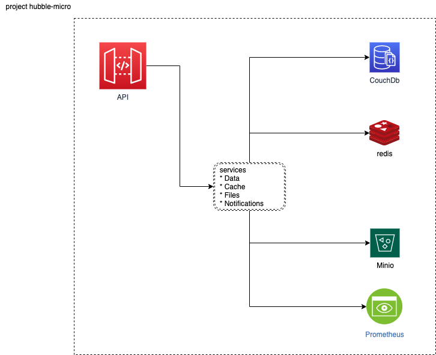

# atlas inception deck

<details open>
<summary>Why are we here?</summary>

hyper63 is a service gateway that provides

The mission of hyper63 is to take a different approach to software, this
approach focuses on shortening the gap between entry level developer to senior
level. hyper63 believes this can occur by reducing the surface area of
application development and generalizing common services.

</details>

<details open>
<summary>Elevator Pitch</summary>

atlas is a backend as a service platform that generalizes common services using
a ports and adapter model. Developers can swap out different implementations of
common services for their preferred backend stack. `atlas` is a standalone
container specifically built for micro-services.

atlas is the fastest way to get going on your micro-service, it gives you common
services for data, cache, files and notifications.

```
For developers
who build micro-services
the atlas container
is a backend-as-a-service container
that provides common services for data, cache, files, and notifications
Unlike tools like AWS Amplify or Firebase
our product can run anywhere on any cloud
```

</details>

<details>
<summary>Product Box </summary>

</details>

<details>
<summary>Not in scope</summary>

What is not in scope for atlas in this release?

- no capability to connect to services sources outside of the service boundary
- no managed services for this release
- extensibility - micro v1 is focused on simplicity
- server-less - not in scope for this release just cloud-native

</details>

<details>
<summary>Meet your neighbors</summary>

What attributes do we need to make sure we account for to ship!

- Security

Must address access, the purpose of this micro-service is to run within a
secured environment like a kubernetes environment or a vpc. API Keys will be
need to be managed for dynamic runtime environments.

- Compliance

N/A for micro

- Support

Opensource support will be managed by a community board. Professional support
services will be offered on an annual license bases.

</details>

<details>
<summary>Show the solution</summary>



[Design Document](design/index.md)

</details>

<details>
<summary>Ask what keeps us up at night</summary>

What are the product risks?

- Small team
- Opensource and distributed
- Spaced implementation

</details>

<details>
<summary>Size it up</summary>

Do we have a 1, 3, 6 month project here? (rough guess)

From design to delivery the rough guess is we have a 3 month project scope:

- 1 month to get the initial implementation working
- 1 month to review and ratify design and implementation
- 1 month to test and iterate on feedback with current constraints

</details>

<details>
<summary>Be clear on what is going to give</summary>

In order to ship a viable project we must be clear on what is going to give,
often times you can have all the things, you must make hard decisions on what
can and cannot be accomplished within your constraints.

- Scope - flexible, but focus on keeping small
- Quality - all business rule code needs to be tested and reviewed
- Delivery Date - flexible to keep quality high
- Budget - strategic if justification for specialization then consider
- Ease of use - strategic and core of the value prop for customers
- Simplicity - strategic
- Detailed audits - volunteers based

</details>

<details>
<summary>Show what it is going to take</summary>

This is an opensource project and it will take all of the following
competencies:

- Project manager
- UX Designer
- Developers
- Analyst
- Customer
- Tester

These competencies can happen over time and input and suggestions can occur via
change requests and RFCs (Request for Change).

</details>
